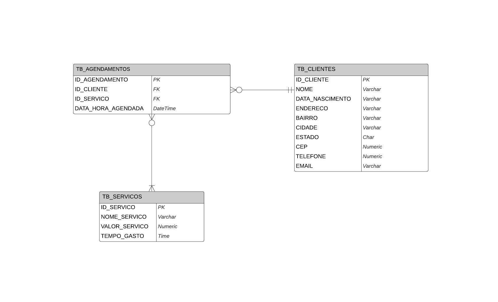

# MVP - Agenda de Salão de Beleza

Este é um MVP (Minimum Viable Product) de uma agenda de salão de beleza, demonstrando como criar uma API RESTful usando .NET Core 6.0 para realizar operações CRUD (Create, Read, Update, Delete) e como consumir essa API em uma aplicação web utilizando MVC Razor e Bootstrap. O projeto também inclui integração com um banco de dados SQL Server.

## Clonando e Executando o Projeto

Para clonar e executar este projeto localmente, siga estas etapas:

1. Certifique-se de ter o [.NET 6.0 SDK](https://dotnet.microsoft.com/download/dotnet/6.0) instalado em sua máquina.
   
2. Clone o repositório para o seu ambiente local:
```bash
  git clone https://github.com/Larissatds/SistemaAgendamentosMVP.git
```

3. Navegue até o diretório do projeto:
```bash
  cd seu-repositorio
```

4. Abra a solução no Visual Studio ou execute o seguinte comando para iniciar o projeto:
```arduino
dotnet run
```

Isso iniciará tanto a API quanto a aplicação web.

## Configurando o Banco de Dados

Este projeto requer um banco de dados SQL Server para armazenar os dados. Siga estas etapas para configurar o banco de dados:

1. Certifique-se de ter o SQL Server instalado e em execução em sua máquina.

2. Crie um novo banco de dados no SQL Server. Você pode fazer isso usando o SQL Server Management Studio ou qualquer outra ferramenta de gerenciamento de banco de dados que preferir.

3. Execute o script `script_banco_de_dados.sql` fornecido no diretório do projeto para criar as tabelas necessárias no banco de dados.

4. Abra o arquivo `appsettings.json` no projeto da API e defina a cadeia de conexão do banco de dados para apontar para o banco de dados que você criou.

Exemplo de `appsettings.json`:

```json
{
  "ConnectionStrings": {
    "DefaultConnection": "Server=SEU_SERVIDOR;Database=SEU_BANCO_DE_DADOS;Trusted_Connection=True;MultipleActiveResultSets=true"
  },
}
```
Substitua `SEU_SERVIDOR` pelo nome do seu servidor SQL Server e `SEU_BANCO_DE_DADOS` pelo nome do banco de dados que você criou.

Com essas configurações, o projeto estará pronto para ser executado e o banco de dados estará configurado corretamente para armazenar os dados da aplicação.

## Modelo Entidade-Relacionamento (MER)

Você pode visualizar o Modelo Entidade-Relacionamento (MER) do banco de dados abaixo:



## Conclusão

Sinta-se à vontade para enviar sugestões, relatórios ou bugs. Basta abrir uma issue.

Espero que este documento seja útil para entender e configurar o projeto. Se você tiver alguma dúvida ou precisar de assistência adicional, entre em contato comigo.


